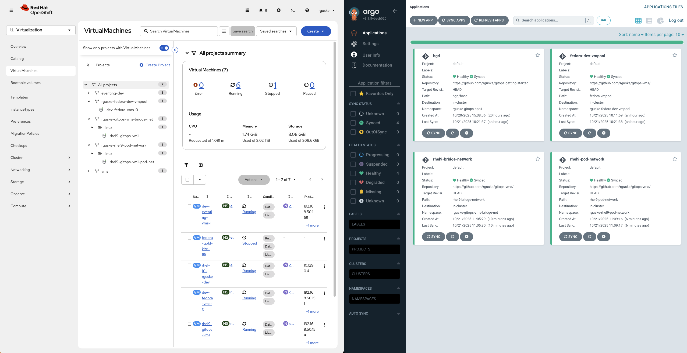

# OpenShift Virtualization meets GitOps

This repo provides examples on how to deploy VMs in OpenShift Virtualization using a GitOps approach.

The repo is structured as follows:

```code
.
├── fedora-vmpool
│   ├── base
│   └── overlays
│       ├── coe-lab
│       └── jarvislab
├── rhel9-bridge-network
│   ├── base
│   └── overlays
│       ├── coe-lab
│       └── jarvislab
├── rhel9-pod-network
│   ├── base
│   └── overlays
│       ├── coe-lab
│       └── jarvislab
├── static
└── windows
```

The `base` directories containing the main `VirtualMachine` or `VirtualMachinePool` configurations. The `overlays` directories are for specific adjustments regarding either networking, storage or both.

The following YAML defines a Argo CD Application:

```yaml
apiVersion: argoproj.io/v1alpha1
kind: Application
metadata:
  name: 'APPLICATION NAME'
spec:
  destination:
    namespace: 'NAMESPACE'
    server: https://kubernetes.default.svc
  source:
    path: 'PATH'
    repoURL: https://github.com/rguske/gitops-vms/
    targetRevision: HEAD
  project: default
  syncPolicy:
    automated:
      prune: false
      selfHeal: true
    syncOptions:
      - CreateNamespace=true
```

